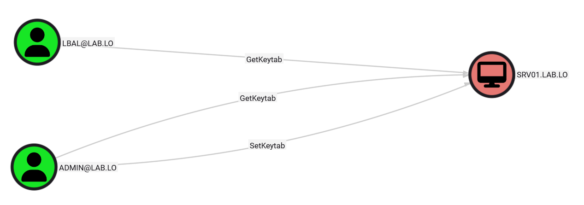
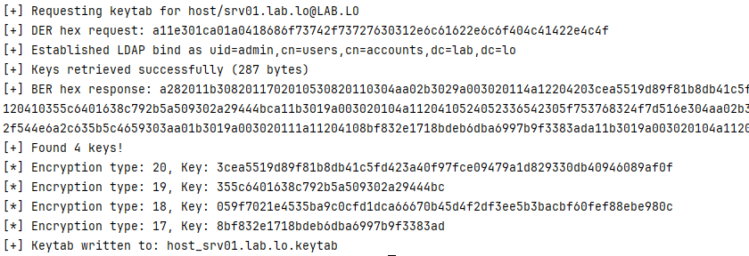
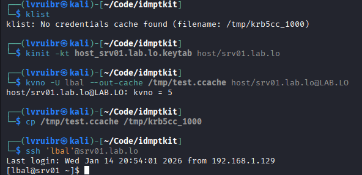
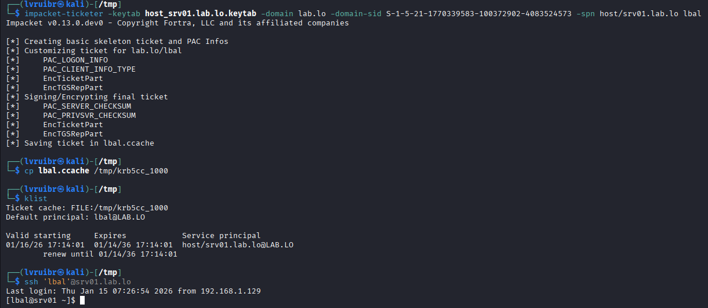
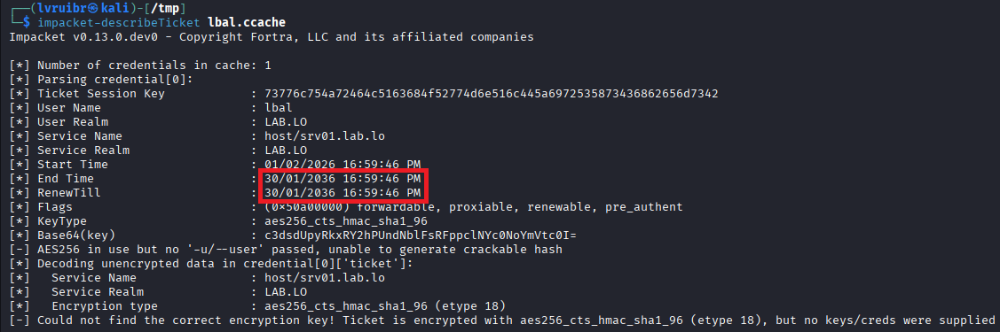
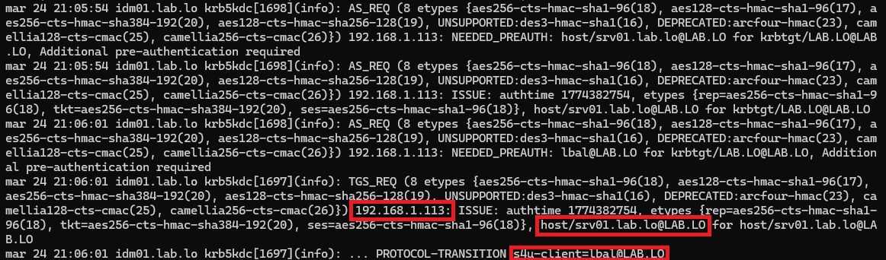
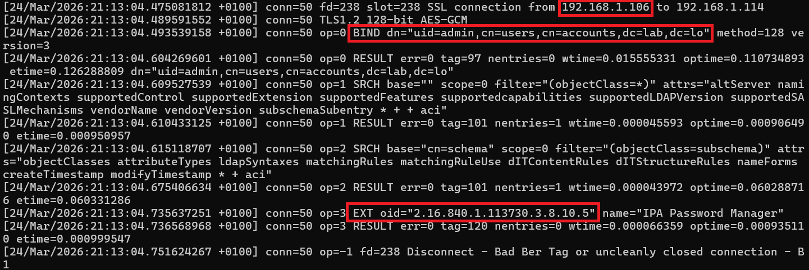

# Leveraging Keytab Rights

FreeIPA and Red Hat Identity Management support particular rights that allow specific users to retrieve the keytab of hosts or services remotely. Legitimately, this feature is particularly useful in high-availability scenario where multiple hosts or services must share the same keytab or when setting up cold spare servers.

Nonetheless, allowing the retrieval of a keytab remotely can obviously be abused by an adversary to compromise the related host or services. Existing research mentions that services can be compromised by getting keytab remotely[^1]. That principle can be extended to host, not just to compromise the host account itself but also the related server. Either way, the compromise of the underlying service or host comes from leveraging S4U2Self or crafting a silver ticket.

By analogy with an Active Directory environment and from an attacker's perspective, the rights to retrieve a keytab are similar to the ability to read passwords via LAPS.

## Retrieving Keytab

By default, users (even admins) do not have the rights to retrieve keytab remotely. [IDMHound](https://github.com/lvruibr/idmhound) can be used to fetch and map those rights into BloodHound and to identify sensitive accounts with such permission. In addition to retrieving a keytab remotely, users may also have the permission to set a keytab for a given host or service.

FreeIPA provides a dedicated tool *ipa-getkeytab[^2]* that can be used to retrieve a keytab remotely with an authorized account. In fact, it relies on an extended LDAP operation which returns the keytab upon success[^3]. Obviously, the existing tool *ipa-getkeytab* can be used to retrieve a keytab but for pentesting purposes it may be more convenient to use a python script that has fewer dependencies and that is more portable.

With a keytab at hand, it is of course possible to interact with the IPA realm as the compromised host or service, which is particularly interesting if that account has high privileges within the realm. 

In addition, high privileges can be obtained on the underlying service or host itself. There are essentially two ways to obtain a TGS in the name of a highly privileged user.

First, Kerberos S4U2Self mechanics can be leveraged. The attacker can authenticate using the compromised keytab and obtain a TGT in the name of the host or service. Then, a TGS for itself (*host/srv01.lab.lo* in the example below), but in the name of a highly privileged user can be obtained. Finally, that TGS can be used to SSH to the underlying host for example, thus fully compromising it.

Alternatively, *ticketer[^4]* can be used to craft a silver ticket given the keytab for the related host or services (*host/srv01.lab.lo* again), in the name of a privilege user. The crafted TGS can then be used to SSH in the case of a server.

Either ways, the underlying host or service can likely be fully compromised once the keytab of the related account is retrieved.

## Detection opportunities

The attack described before has essentially three *noisy* steps:
1. Getting (or setting) the keytab remotely.
2. Performing an S4U2Self operation.
3. Presenting a silver ticket.

The detection of silver ticket attacks is quite similar to Active Directory environment. Silver tickets crafted with *ticketer* present, by default, an unusually long lifetime (10 years) which is definitely an IOC. Nonetheless, in theory, it would be possible to generate a silver ticket that has no such artifact. In such cases, detecting it would require to correlate the TGS presented to the host or service with the list of TGS generated by the IPA servers. Legitimate TGS should be created by IPA servers, while the silver tickets are generated on the attacker machine and therefore never appear on the IPA servers.

The S4U2Self operation is slightly more stealthy since the IDM server is actually generating the TGS, after presenting a legitimate TGT obtained with a valid keytab. Therefore, a different detection strategy should be applied. In this scenario, the TGT and TGS requests are being performed from the attacker machine, which brings some inconsistencies in the originating IP address compared to the legitimate host. In fact, a legitimate S4U2Self operation is always performed from the legitimate host or service itself which allows establishing a baseline. The S4U2Self operation from the attacker machine, that has a different IP address causes a deviation from that baseline which can be detected using the logs at _/var/log/krb5kdc.log_.

The aforementioned opportunities are applicable in Active Directory environments and in FreeIPA environments. However, they are not convenient to implement from the standpoint of defenders. The most effective way to detect keytab abuse is probably to monitor remote keytab retrieval requests on the IPA servers. Legitimate keytab retrieval requests are likely very limited and coming from specific machines, causing deviation from the baseline when an attacker perform such attacks. The retrieval requests using LDAP extended operations are logged in the file _/var/log/dirsrv/slapd-REALM/access_, along with the related IP address.

## Conclusion

While remote keytab retrieval is a convenient feature in complex environments, it also introduces a particularly effective attack primitive for an adversary aiming to compromise a given host or service. Access to a keytab exposes authentication material of the associated principal, often leading to the compromise of the underlying host.

From a defensive standpoint, several detection opportunities exist. Among them, monitoring remote keytab retrieval and comparing them against an established baseline remains the most practical approach. These operations are typically infrequent and originate from a limited set of systems, making any deviation a strong indicator of abuse. 

[^1]: [https://tishina.in/ops/freeipa-postexploitation](https://tishina.in/ops/freeipa-postexploitation)
[^2]: [https://github.com/freeipa/freeipa/blob/master/client/ipa-getkeytab.c](https://github.com/freeipa/freeipa/blob/master/client/ipa-getkeytab.c)
[^3]: [https://www.freeipa.org/page/V4/Keytab_Retrieval](https://www.freeipa.org/page/V4/Keytab_Retrieval)
[^4]: [https://github.com/fortra/impacket/blob/master/examples/ticketer.py](https://github.com/fortra/impacket/blob/master/examples/ticketer.py)