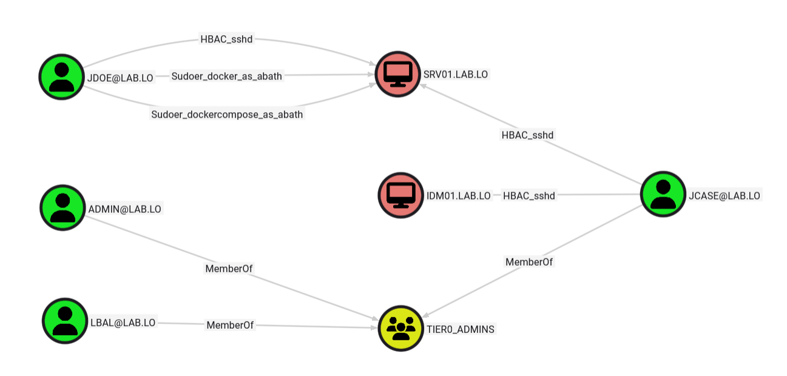
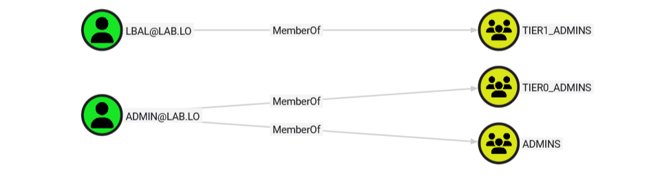
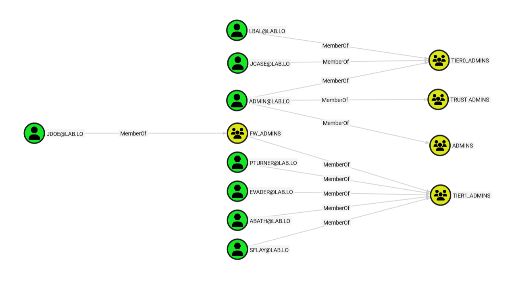
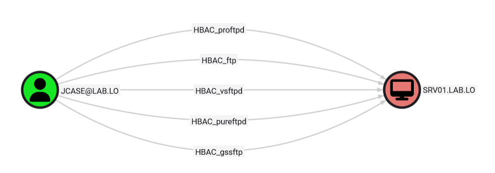
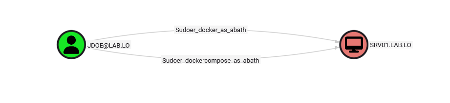

# IDMHound

*Red Hat Identity Management* and *FreeIPA* are the main Linux-based alternatives to Active Directory and share many similarities.

The most notable of these is arguably the high granularity and complexity of their rights, making them prone to errors and misconfigurations.

In addition, the lack of graphing tools allowing mapping identities and relationships did not help audit such environments. That is exactly what [IDMHound](https://github.com/lvruibr/idmhound),  aim to address.

In its current form **IDMHound allows collecting information about users, computers, groups and domains along with three types of relationships** between objects:
* *Group memberships*, that obviously defines what accounts belong to which group.
* *Host-Based Access Controls*, which define who can connect to which machine using what kind of service.
* *Sudoer rights*, that define who can run which commands, where, as whom.

The output can then be fed into Bloodhound to map the realm. 

In terms of objects and membership, the general concepts are quite close to Active Directory workings. Nonetheless, the main lateral movement and local privilege escalation opportunities arise not only from group membership but more often than not also from Host-Based Access Control and Sudoer rights.

Therefore, combining all the nodes and relationships information is key to discovering complex attack paths, combining lateral movement and privilege escalation within the environment.

## Nodes

FreeIPA and Red Hat identity define three main types of accounts, users, computers, and services. Services should always be associated to a computer account and is therefore stored as an attribute of computers in the graph. It allows help keeping a certain consistency with Bloodhound graphs for Active Directory.

Most collected nodes share the same graphical elements as Bloodhound graphs for AD and should therefore be fairly straightforward to grasp.

## Group Membership

Group membership are very close to their Active Directory counterpart and they are represented in the same way using a “MemberOf” edge.

Visualizing group membership is arguably the most straightforward way of quickly identifying interesting targets and overly privileged accounts.

## Host-Based Access Control

Host-Based Access Controls are IDM rules defining who can connect where and how. When looking for attack paths, some are more relevant than others. For instance, when searching for lateral movement opportunities, SSH, RDP and possibly FTP are likely to be the most interesting ones.

Nonetheless, for the sake of completeness, all HBAC are collected. It’s then up to the pentester or auditor to filter out what’s irrelevant and think creatively to leverage them. Each HBAC edge is prefixed with “HBAC”, followed by the name of the service to allow quickly filtering in/out results. When all services are authorized, “HBAC_all” is used as the name of the edge.

In concrete terms, analysing HBAC usually gives a clue as of how to move laterally to other systems. In the example below, tier1_admins are allowed SSH to tier1_machines, but jcase who is not part of tier1_admins also has specific HBAC allowing connecting to this machine using FTP.

## Sudoer

Sudoer rights work similarly to HBAC but define who can run what, where and as whom. Therefore, it takes into consideration four objects:
* *Principals* which will be allowed or denied to act
* *Computers* on which the specific rights apply
* *Services* that can be run with sudo
* *Subjects* that can be impersonated when running a sudo command as some else

All edges related to such rights are prefixed with *Sudoer* and contains the name of the service that can be run along with the name of the account that can be impersonated to run the command.

Graphing such nodes allows identifying privilege escalation vectors, especially locally. As an example, chains combining multiple sudo rights could lead to the complete compromise of a machine: jdoe can run docker commands as _abath_, which looks perfectly ok, at least before checking _abath_ permission.

Unfortunately, _abath_ is part of the tier1_admins who are allowed to execute commands as _root_ on tier1_machines. A creative adversary should be able to leverage such a chain in a few minutes to fully compromise SRV01.

## Conclusion

Ultimately, such granular rights management is a double-edged sword. On one hand, precise rules are a great opportunity to apply best security practices, especially the least privilege principle. On the other hand, the management is complex and leaves plenty of room for accidental misconfiguration. Both perspectives highlight the need to audit this type of environment. 
